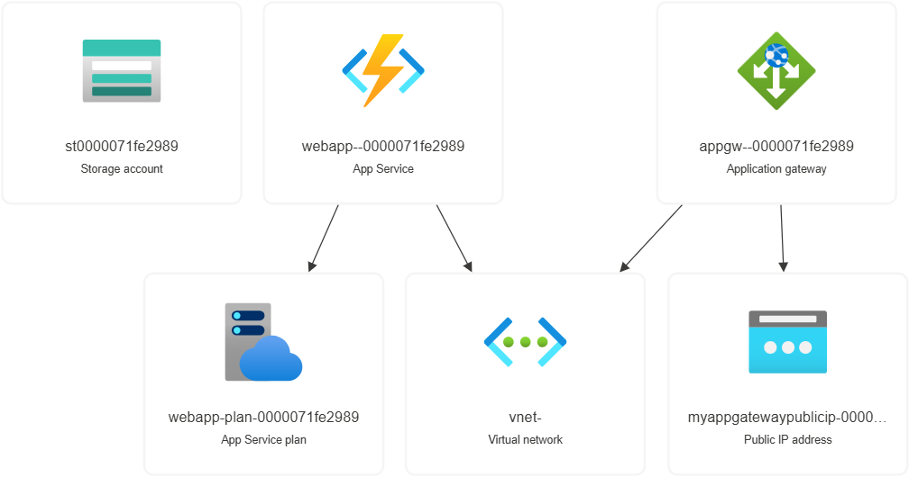

# Azure App Gateway - WAF 2.0 - Azure Function in App Service

## Exemplos base
[Deploy an Azure Function Premium plan with vnet integration
](https://github.com/Azure/azure-quickstart-templates/tree/master/quickstarts/microsoft.web/function-premium-vnet-integration)
[Application Gateway with WAF and firewall policy](https://github.com/Azure/azure-quickstart-templates/blob/master/quickstarts/microsoft.network/application-gateway-waf-firewall-policy/README.md)
[App Gateway with WAF, SSL, IIS and HTTPS redirection](https://github.com/Azure/azure-quickstart-templates/tree/master/quickstarts/microsoft.network/application-gateway-2vms-iis-ssl)